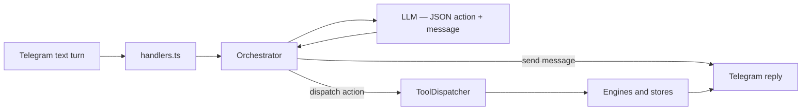

# Architecture

## Overview

ArcPay Agent is a Telegram-first payment workflow service for Arc Testnet.

The system is organized around a few clear layers:

- Telegram transport
- LLM-orchestrated conversation runtime
- tool dispatch into domain engines
- blockchain and Circle integrations
- persistence-backed stores

The runtime entrypoint is `src/index.ts`.

The current production shape is:

- LLM-orchestrated text ingress via `src/core/orchestrator.ts`
- LLM returns a JSON action + message on every turn
- `src/agent/toolDispatcher.ts` executes the action and updates conversation memory
- deterministic payment, schedule, invoice, vendor, analytics, wallet, and history execution
- active invoice session lifecycle inside `InvoiceEngine`
- invoice override and pending-confirm guards inside the active invoice session
- restart-friendly persistence for pending payments and submitted Circle transactions
- agent identity reconciliation that can re-derive the KYC validation request hash from the registered `agentId`

## Runtime Flow

High-level request flow:

1. Telegram message or callback enters through `src/telegram/handlers.ts`
2. Text input enters `src/core/orchestrator.ts`
3. The orchestrator builds a context summary from `ConversationMemory` and calls the LLM
4. The LLM returns a JSON object with `message` (always) and `action` (optional)
5. The orchestrator sends the `message` to the user and adds it to memory
6. If an `action` is present, `src/agent/toolDispatcher.ts` runs the corresponding engine method
7. For live research actions (crypto prices, Arc stats), `src/tools/researchTools.ts` fetches data and the LLM synthesizes a reply
8. Engines use stores and blockchain clients
9. Telegram messages are sent back to the user

For callback-based flows such as payment confirmation:

1. `preparePayment()` stores a pending payment
2. Telegram inline buttons trigger `processCallback()`
3. `PaymentEngine` validates Arc network and balance
4. If needed, approval is submitted through Circle
5. Payment is submitted through Circle
6. The transaction is reconciled until terminal state
7. Payment logs, schedules, and requests are finalized only after success

## Walkthroughs

### Conversational turn

Example: `I need help`

1. Telegram delivers the message to `src/telegram/handlers.ts`
2. `src/core/orchestrator.ts` receives the text
3. The orchestrator builds context from conversation memory and calls the LLM
4. The LLM returns `{"message": "I can help with payments, invoices..."}`
5. The orchestrator sends the message; no action executes

### Direct payment turn

Example: `send 5 usdc to aws`

1. The orchestrator calls the LLM with the user message and conversation context
2. The LLM returns `{"action":"create_payment","message":"Preparing 5 USDC to aws.","amount":5,"beneficiary":"aws"}`
3. The orchestrator sends the message, then calls `ToolDispatcher.execute()`
4. `paymentEngine.preparePayment()` checks balance and Arc reserve, then renders confirmation
5. Payment submission still requires the explicit existing review flow

### Compound turn

Example: `check my balance and send 1 usdc to Jack`

1. The system prompt instructs the LLM to prefer the most consequential action
2. The LLM returns `{"action":"create_payment","message":"Preparing 1 USDC to Jack.","amount":1,"beneficiary":"Jack"}`
3. The payment flow already shows balance context — no separate `show_wallet` needed

### Invoice follow-up turn

Example: `I've reviewed it. Go ahead.`

1. An active invoice session already exists in `review_required`
2. The orchestrator sends the message with invoice context from `ConversationMemory`
3. The LLM resolves the text as an override and returns `{"action":"create_payment",...}`
4. `invoice_context` is read from the active invoice session
5. Payment review opens and the invoice session moves to `awaiting_payment_confirmation`

## Main Modules

### `src/index.ts`

Central composition root.

Responsibilities:

- loads runtime config
- initializes persistence
- creates provider, Circle client, bot, stores, engines
- creates orchestrator, tool dispatcher, internal tools
- starts health server
- starts scheduler and reconciliation timers

This file is the best place to understand the actual feature surface of the app.

### `src/telegram/`

Telegram-facing transport layer.

Files:

- `bot.ts`: Telegram bot creation and polling error handling
- `handlers.ts`: command handling, upload handling, callback query flows

Responsibilities:

- `/start`, `/help`, `/llmkey`
- payment request deep links
- invoice PDF/photo ingestion
- schedule and request button callbacks
- user ownership checks on action buttons
- text ingress to orchestrator

### `src/core/`

Orchestrator — the main runtime loop.

Files:

- `orchestrator.ts`

Responsibilities:

- receive text turns
- build context summary from conversation memory
- call the LLM via `src/ai/llmJsonClient.ts`
- send the LLM message to the user
- dispatch the LLM action to `ToolDispatcher`
- handle live research actions via `ResearchTools`
- maintain conversation memory for each chat

### `src/agent/`

Tool dispatch, internal tools, and conversation memory.

Files:

- `toolDispatcher.ts`
- `internalTools.ts`
- `conversationMemory.ts`

Responsibilities:

- map validated actions to engine methods
- hold last-payment, last-vendor, last-schedule, last-invoice references for the LLM context
- expose internal read tools for wallet summary, pending payments, account snapshot, etc.

### `src/ai/`

LLM client and system prompt.

Files:

- `llmJsonClient.ts`
- `systemPrompt.ts`

Responsibilities:

- call the user's BYOK LLM with the current conversation history
- parse the JSON response
- define the full system prompt including actions, Arc knowledge, and behavior rules

### `src/tools/`

Live research tools.

Files:

- `researchTools.ts`

Responsibilities:

- fetch live crypto prices from CoinGecko
- query Arc network block stats
- look up user on-chain activity via the router reader

### `src/engines/`

Domain logic lives here.

#### `paymentEngine.ts`

Most critical engine in the system.

Responsibilities:

- prepare payment state
- validate Arc chain ID
- enforce Arc gas reserve
- check router allowance
- submit approval and payment through Circle
- persist pending and submitted state
- reconcile delayed Circle transactions
- finalize logs and trigger request/schedule completion

#### `invoiceEngine.ts`

Responsibilities:

- parse PDF/image input
- extract fields
- normalize amounts/currencies
- own the active invoice session lifecycle
- expose invoice readiness, review, and payment-prep state
- prepare invoice-derived payment suggestions only from an active session
- suppress redundant analyze captions once upload analysis is already in progress
- move review-required invoices into `awaiting_override` and then `awaiting_payment_confirmation`
- close invoice sessions after payment success, cancel, timeout, or replacement upload

#### `paymentRequestEngine.ts`

Responsibilities:

- create request links
- resolve deep links
- mark requests as paid only after payment confirmation

#### `analyticsEngine.ts`

Responsibilities:

- payment summaries
- vendor spending
- monthly breakdowns

#### `riskEngine.ts`

Responsibilities:

- invoice risk flags
- duplicate detection
- suspicious signal scoring

#### `agentIdentityEngine.ts`

Responsibilities:

- register and reconcile the ERC-8004 agent identity
- update metadata
- submit reputation records
- submit validation requests and responses
- derive the canonical KYC validation request hash from the registered `agentId`
- recover validation status from chain after local-store loss

### `src/blockchain/`

Chain and Circle integration layer.

Files:

- `arcConfig.ts`: Arc constants and gas reserve config
- `usdc.ts`: ERC-20 helpers and calldata encoding
- `arcRouter.ts`: router calldata encoding
- `routerReader.ts`: router event scanning
- `circleClient.ts`: Circle API client for wallets and transactions

Key point:

- Arc uses USDC as gas
- the app explicitly reserves extra USDC before payment confirmation

### `src/storage/`

Persistence-backed domain stores.

Important stores:

- `walletStore.ts`
- `vendorStore.ts`
- `invoiceStore.ts`
- `paymentLogs.ts`
- `paymentRequests.ts`
- `schedules.ts`
- `llmKeyStore.ts`
- `pendingPayments.ts`
- `submittedTransactions.ts`
- `userPreferences.ts`

Persistence backend:

- SQLite by default
- PostgreSQL if `DATABASE_URL` is present

The backend abstraction is implemented in `persistence.ts`.

### `src/services/`

Background support services.

Files:

- `scheduler.ts`
- `fxRateService.ts`

Scheduler behavior:

- checks due schedules every 10 seconds
- sends a Telegram reminder with action buttons
- does not auto-pay without user confirmation

## State Model

### Conversation memory

LLM-facing conversational recall.

Used for:

- recent user/assistant turns
- last invoice, last vendor, last payment, last schedule references
- context building for each LLM call

Stored in `conversationMemory.ts`.

Important constraint:

- `lastInvoice` is recall-only
- it is not allowed to reopen invoice payment prep without an active invoice session

### Pending payment

Stored before user confirmation.

Used for:

- confirm
- cancel
- update amount/vendor/memo

Persisted in `pendingPayments.ts`.

Invoice-derived pending payments also carry invoice source metadata so post-confirm cleanup can close the invoice session.

### Submitted transaction

Stored after a payment or approval submission starts.

Used for:

- duplicate submit prevention
- delayed Circle reconciliation
- restart recovery

Persisted in `submittedTransactions.ts`.

### Confirmed payment log

Stored only after successful terminal completion.

Used for:

- payment history
- analytics
- vendor totals

Persisted in `paymentLogs.ts`.

## Health and Readiness

HTTP server lives in `src/http.ts`.

Endpoints:

- `/health`
- `/ready`
- `/`

Readiness tracks:

- persistence
- bot
- scheduler
- RPC

Current overall readiness is based on persistence plus bot readiness.

## Important Design Constraints

- request and schedule completion must happen only after successful payment confirmation
- pending and submitted state must survive restarts
- Arc network must match expected chain ID before payment submission
- user action buttons are owner-scoped by Telegram user ID
- local payment history is the default truth for confirmed user payments

## Known Limitations

- analytics and some stores still use `number` for amounts
- wallet intelligence has explorer-style dependencies
- router history is a scanned view, not a full indexed ledger
- scheduler is reminder-based, not autonomous
- multi-instance deployments need stronger shared-state guarantees

## Suggested Entry Points

If you are changing:

- payment behavior: start with `src/engines/paymentEngine.ts`
- user interaction: start with `src/telegram/handlers.ts`
- conversation routing: start with `src/core/orchestrator.ts`
- action dispatch: start with `src/agent/toolDispatcher.ts`
- system prompt and LLM behavior: start with `src/ai/systemPrompt.ts`
- storage semantics: start with `src/storage/persistence.ts`
- app wiring: start with `src/index.ts`
