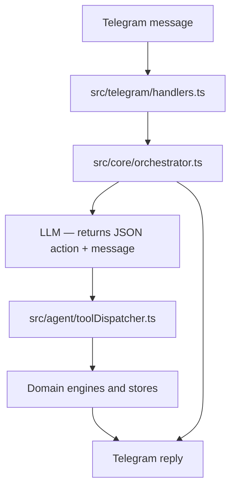

# Arc Pay Agent

Arc Pay Agent is a Telegram-based USDC payment copilot for Arc Testnet.

GitBook-friendly docs scaffolding now lives under [`docs/`](./docs/README.md).

It combines:

- Telegram bot workflows
- Circle developer-controlled wallets
- optional ERC-8004 agent identity on Arc Testnet
- Arc router execution with USDC-denominated gas
- conversational payment, schedule, vendor, and invoice handling
- invoice extraction from PDF and image uploads
- local payment history, reporting, and schedule reminders
- optional bring-your-own-key LLM support for richer natural language handling
- invoice session guards that prevent stale reopen during confirm or after payment

## What It Does

- creates one Arc testnet wallet per Telegram user through Circle
- sends USDC to saved vendors or raw `0x...` addresses
- creates payment request deep links through `/start req_<id>`
- analyzes invoices, explains risk flags, and prepares invoice-linked payments
- can expose Arc Pay Agent's own onchain registration status when ERC-8004 is configured
- stores pending and submitted Circle payment state so restarts do not lose in-flight workflows
- supports multi-turn follow-ups such as:
  - `send payment` -> `3 usdc` -> `to aws`
  - `schedule a payment` -> `5 usdc` -> `to aws` -> `next friday at 3pm`
  - `pay that invoice`
  - `show me the vendor I paid most recently`
- accepts natural requests such as:
  - `check my balance and then send 5 dollars to aws`
  - `pay Anthropic tomorrow morning`
  - `check the invoice first, then pay it if it looks safe`

## Product Model

Arc Pay Agent is not a general-purpose chatbot. It is a payment assistant with a strict execution model:

- Telegram collects input and renders action buttons
- the LLM layer interprets the request and manages follow-up questions
- the tool dispatcher routes validated actions into domain engines
- the engine layer owns all payment, schedule, and invoice side effects
- money movement still ends in the existing explicit review and confirmation flow
- a payment is only considered complete after Circle reaches a successful terminal state

## Conversational Model

The message runtime is **LLM-orchestrated**:

1. `src/core/orchestrator.ts` receives each text turn
2. the orchestrator sends conversation history and user message to the LLM
3. the LLM returns a JSON object with a `message` field and an optional `action` field
4. the orchestrator sends the `message` to the user immediately
5. if an `action` is present, `src/agent/toolDispatcher.ts` executes it
6. the tool dispatcher calls the appropriate domain engine and updates conversation memory

LLM usage is BYOK only:

- each user may save their own provider key with `/llmkey ...`
- if no key is set, the orchestrator falls back to narrow explicit commands plus short guidance
- deterministic execution and payment confirmation do not depend on LLM wording quality

## Runtime Graph



## Runtime Walkthrough

### Example 1: broad help

1. The user sends `What can you do?`
2. `src/core/orchestrator.ts` includes conversation history and sends it to the LLM
3. The LLM returns `{"message": "I can help with USDC payments, invoices..."}`
4. The orchestrator sends the message; no action runs

### Example 2: direct payment prep

1. The user sends `send 5 usdc to aws`
2. The LLM returns `{"action":"create_payment","message":"Preparing a 5 USDC payment to aws.","amount":5,"beneficiary":"aws"}`
3. The orchestrator sends the message, then calls the tool dispatcher
4. `src/agent/toolDispatcher.ts` routes the action into `paymentEngine.preparePayment()`
5. `src/engines/paymentEngine.ts` prepares payment state and shows the confirmation flow

### Example 3: invoice follow-up

1. The user uploads an invoice
2. `src/telegram/handlers.ts` sends it through `InvoiceEngine`, then forwards a rich summary to the orchestrator
3. The LLM receives the invoice context and produces an analysis reply
4. Later, `pay that invoice` returns `{"action":"create_payment",...}` using the session context
5. The payment engine prepares the invoice-linked payment

## Core Architecture

- `src/index.ts`
  App bootstrap, dependency wiring, engine creation, scheduler setup, HTTP readiness server.
- `src/telegram/`
  Telegram transport, `/start`, `/help`, `/llmkey`, invoice uploads, callback queries, text ingress.
- `src/core/`
  Orchestrator — receives text turns, calls the LLM, sends replies, dispatches tool actions.
- `src/agent/`
  Tool dispatcher, internal tool adapters, conversation memory.
- `src/ai/`
  LLM JSON client, system prompt, conversation context building.
- `src/tools/`
  Live research tools (crypto prices, Arc network stats, on-chain activity).
- `src/engines/`
  Payment execution, invoice analysis, payment requests, analytics, risk handling.
- `src/blockchain/`
  Arc config, USDC helpers, Arc router encoding, Circle client, router reads.
- `src/storage/`
  Wallets, vendors, invoices, schedules, payment logs, pending payments, submitted Circle transactions, encrypted user LLM config.
- `src/services/`
  Scheduler and FX helper services.

## Payment Lifecycle

The payment flow is intentionally staged:

1. The user prepares a payment with text such as `send 5 usdc to aws`.
2. The bot shows a review message with `Confirm` and `Cancel`.
3. Before submission, the payment engine checks:
   - Arc chain ID
   - recipient resolution
   - wallet balance
   - Arc gas reserve in USDC
   - router allowance
4. If approval is required, the user sees `Approve via Circle`.
5. Circle contract execution is submitted.
6. The payment remains pending until Circle returns a terminal state.
7. Only then does Arc Pay Agent mark payment requests or schedules as completed and write payment logs.

Important runtime safeguards:

- duplicate button submits are blocked
- submitted Circle transactions are reconciled after restarts
- request and schedule completion only happen after confirmed payment success
- Arc gas reserve is configurable with `ARC_GAS_RESERVE_USDC`

## Scheduler Behavior

Scheduled payments are reminders plus explicit user confirmation, not autonomous autopay.

The scheduler checks due payments every 10 seconds and sends a Telegram action message:

- `Send now`
- `Cancel`

If the user confirms and the payment later succeeds, the schedule is marked executed. One-time schedules are deactivated; recurring schedules move to the next due time.

## Invoice Intelligence

Invoice handling includes:

- PDF and image extraction
- OCR normalization
- candidate scoring for vendor, date, and invoice number
- fuzzy saved-vendor resolution
- conversational risk summaries
- active invoice-session lifecycle with expiry and cleanup
- review-gated invoice payment prep
- safer invoice-linked follow-up handling

Typical invoice flow:

1. upload a PDF or image
2. `InvoiceEngine` opens one active invoice session for the chat
3. review extracted vendor, amount, date, and invoice number
4. continue naturally:
   - ask whether it looks safe
   - ask what looks off or what still needs checking
   - tell the agent to line it up when you are ready
5. if the invoice needs review, Arc Pay Agent asks for an explicit natural override such as "go ahead anyway"
6. if the vendor is unknown, Arc Pay Agent asks you to save a vendor first
7. once payment review is already open, follow-ups should point back to `yes` or `cancel`
8. after payment confirmation, the active invoice session closes and a later payment request requires a new upload

Risk output explains *why* an invoice needs review instead of only listing raw flags.

Invoice session rules:

- only one active invoice session exists per chat
- a new upload replaces the previous active invoice session
- `REVIEW` invoices require an explicit override such as "go ahead anyway"
- `HIGH_RISK` invoices do not open payment review
- once payment review is open, the session is treated as `awaiting_payment_confirmation`
- stale `lastInvoice` memory is recall-only and cannot reopen payment prep by itself

## Agent Identity on Arc

Arc Pay Agent can optionally register a **service-level** onchain agent identity on Arc Testnet using ERC-8004.

This identity is:

- application-level, not user-level
- separate from user payment wallets
- intended for identity, metadata, trust, and discovery
- not used as payment authority

Current v1 support includes:

- storing owner and validator service wallets
- registering Arc Pay Agent through the IdentityRegistry
- persisting agent ID, metadata URI, and registration transaction state
- read-only status queries from inside the app
- admin scripts for registration, status checks, reputation submission, and validation flows

Payment execution remains unchanged and still goes through the existing review and confirmation boundary.

## Storage and Persistence

Current persistence behavior:

- default backend: SQLite in `data/arcpay.sqlite`
- optional backend: PostgreSQL via `DATABASE_URL`
- legacy JSON files in `data/` are migrated into the active store when accessed

Persisted runtime data includes:

- wallets
- vendors
- invoices
- payment requests
- payment logs
- schedules
- user preferences
- encrypted user LLM credentials
- pending payment sessions
- submitted Circle transactions awaiting reconciliation

## Tech Stack

- Node.js
- TypeScript
- Telegram Bot API
- `ethers`
- Circle developer-controlled wallets API
- Arc Testnet RPC
- `pdf-parse`
- `tesseract.js`
- SQLite (`node:sqlite`)
- PostgreSQL via `pg` when `DATABASE_URL` is present
- Vitest

## Requirements

- Node.js 20+ recommended
- Telegram bot token
- Circle developer-controlled wallet credentials
- Arc Testnet USDC contract address
- Arc router contract address

## Environment Variables

### Required

These are the non-test values required by current runtime validation.

| Variable | Purpose |
| --- | --- |
| `PAYABLES_ROUTER_ADDRESS` | Arc router contract address |
| `USDC_ADDRESS` | Arc USDC token contract address |
| `LLM_KEY_SECRET` | Secret used to encrypt user-saved LLM API keys |
| `CIRCLE_API_KEY` | Circle API key |
| `CIRCLE_ENTITY_SECRET` | 32-byte hex entity secret |
| `CIRCLE_WALLET_SET_ID` | Circle wallet set ID |

### Optional

| Variable | Purpose |
| --- | --- |
| `TELEGRAM_TOKEN` | Telegram bot token; if missing, the process can still boot but Telegram polling is disabled |
| `BOT_USERNAME` | Bot username used for request deep links, default `ArcPayAgentBot` |
| `ARC_RPC_URL` | Arc RPC URL, default official Arc testnet RPC |
| `DATABASE_URL` | Enable PostgreSQL instead of SQLite |
| `PORT` | Health server port, default `3000` |
| `TZ` | Runtime timezone |
| `ARC_CHAIN_ID` | Override expected Arc chain ID, default `5042002` |
| `ARC_GAS_RESERVE_USDC` | Extra USDC reserve required before sending, default `0.10` |
| `CIRCLE_API_URL` | Circle API base URL, default `https://api.circle.com/v1/w3s` |
| `PAYMENT_HISTORY_SOURCE` | `local` or `router`, default `local` |
| `PAYMENT_HISTORY_CHUNK` | Router scan chunk size |
| `PAYMENT_HISTORY_WINDOWS` | Number of recent block windows to scan |
| `CIRCLE_TX_POLL_ATTEMPTS` | Poll attempts for Circle terminal state |
| `CIRCLE_TX_POLL_INTERVAL_MS` | Poll interval for Circle terminal state |
| `FX_API_BASE_URL` | Override the FX rate API base URL used during invoice settlement conversion |
| `DEFAULT_LOCALE` | Default locale fallback for users without stored preferences, default `en-US` |
| `ARC_AGENT_METADATA_URI` | Metadata URI used for ERC-8004 registration |
| `ARC_AGENT_ID` | Optional known ERC-8004 agent ID used during recovery |
| `ARC_AGENT_OWNER_WALLET_ID` | Optional pre-created Circle wallet ID for the service owner wallet |
| `ARC_AGENT_VALIDATOR_WALLET_ID` | Optional pre-created Circle wallet ID for the service validator wallet |
| `ARC_AGENT_WALLET_SET_NAME` | Optional wallet set name used when Arc Pay Agent creates service wallets, default `Arc Pay Agent ERC8004` |
| `ERC8004_IDENTITY_REGISTRY_ADDRESS` | Override the Arc Testnet IdentityRegistry address |
| `ERC8004_REPUTATION_REGISTRY_ADDRESS` | Override the Arc Testnet ReputationRegistry address |
| `ERC8004_VALIDATION_REGISTRY_ADDRESS` | Override the Arc Testnet ValidationRegistry address |

### Example `.env`

```env
TELEGRAM_TOKEN=
BOT_USERNAME=ArcPayAgentBot

ARC_RPC_URL=https://rpc.testnet.arc.network
PAYABLES_ROUTER_ADDRESS=
USDC_ADDRESS=
ARC_GAS_RESERVE_USDC=0.10

LLM_KEY_SECRET=

CIRCLE_API_KEY=
CIRCLE_ENTITY_SECRET=
CIRCLE_WALLET_SET_ID=
CIRCLE_API_URL=https://api.circle.com/v1/w3s

ARC_AGENT_METADATA_URI=
ARC_AGENT_ID=
ARC_AGENT_OWNER_WALLET_ID=
ARC_AGENT_VALIDATOR_WALLET_ID=
ARC_AGENT_WALLET_SET_NAME=
ERC8004_IDENTITY_REGISTRY_ADDRESS=
ERC8004_REPUTATION_REGISTRY_ADDRESS=
ERC8004_VALIDATION_REGISTRY_ADDRESS=

PORT=3000
TZ=Europe/Istanbul
```

Notes:

- `PAYABLES_ROUTER_ADDRESS` and `USDC_ADDRESS` must be valid EVM addresses
- `CIRCLE_ENTITY_SECRET` must be a 64-character hex string
- Leave optional ERC-8004 override fields blank to use the Arc Testnet defaults from the app
- Arc RPC is validated against the expected Arc chain ID before payments are allowed
- LLM keys are encrypted at rest with `LLM_KEY_SECRET`

## Agent Identity Maintenance

If the local identity store is cleared but the ERC-8004 agent is still registered onchain, recover the local record first:

```bash
npm run agent:reconcile
```

This works best when these env vars are set:

- `ARC_AGENT_OWNER_WALLET_ID`
- `ARC_AGENT_ID`

To update metadata for an existing registered agent:

```bash
npm run agent:update-metadata
```

`agent:update-metadata` uses `ARC_AGENT_METADATA_URI` and writes the new URI onchain for the recovered or already-known agent.

To create and persist the Arc tutorial-aligned KYC validation flow for the current registered agent:

```bash
npm run agent:validation:request:kyc
npm run agent:validation:respond:kyc
npm run agent:validation:status
```

KYC validation notes:

- the KYC request hash is derived from the current `agentId`
- `agent:status` and `agent:reconcile` now try to recover that KYC validation record automatically from chain
- this is the recommended validation path for the current project because it matches the Arc ERC-8004 tutorial semantics
- the default KYC response tag is `kyc_verified`

To respond to an existing non-KYC validation request with a custom service-level tag:

```bash
npm run agent:validation:respond -- <requestHash> 100 service_verified
```

Validation response notes:

- `ARC_AGENT_VALIDATOR_WALLET_ID` must be set before writing a validation response
- keep the validator wallet separate from the owner wallet
- the recommended tag for the default KYC flow is `kyc_verified`
- this flow writes a response for an existing request hash; it does not create a new request

## Local Development

Install dependencies:

```bash
npm install
```

Note:

- `npm install` also runs the `postinstall` build step, so the TypeScript app is compiled automatically after dependency installation

Run in development:

```bash
npm run dev
```

Build:

```bash
npm run build
```

Run the built app:

```bash
npm start
```

Run tests:

```bash
npm test
npm run test:unit
npm run test:integration
npm run test:coverage
npx tsc --noEmit
```

Agent identity scripts:

```bash
npm run agent:status
npm run agent:register
npm run agent:reputation -- 95 trusted_payment_agent
npm run agent:validation:request:kyc
npm run agent:validation:respond:kyc
npm run agent:validation:status
npm run agent:validation:request -- ipfs://validation-request-uri
npm run agent:validation:respond -- <requestHash> 100 service_verified
```

## Canonical Commands

The bot supports many natural-language variations, but these are the canonical examples shown in `/help`.

### Wallet

- `create wallet`
- `show wallet`
- `wallet balance`

### Payments

- `send 5 usdc to aws`
- `send 5 usdc to 0x...`
- `request 20 usdc`
- `payment history`

### Vendors

- `save vendor aws 0x...`
- `list vendors`
- `vendor aws`
- `remove vendor aws`

### Invoices

- send a PDF or photo invoice
- `is this invoice safe?`
- `pay that invoice`

### Schedules

- `schedule payment 10 usdc to aws tomorrow`
- `list schedules`
- `cancel schedule <id>`
- `cancel all schedules`

### Reports

- `report`
- `account summary`

### Agent Identity

- `show agent status`
- `what is our agent id?`
- `show agent validation status`

### LLM

- `/llmkey set openai sk-...`
- `/llmkey status`
- `/llmkey model gpt-4.1-mini`
- `/llmkey remove`

## Natural Language Examples

- `check my balance and then send 5 dollars to aws`
- `pay Anthropic tomorrow morning`
- `show me the vendor I paid most recently`
- `show my schedules, then cancel that one`
- `check the invoice first, then pay it if it looks safe`
- `is Arc Pay Agent registered?`
- `how do you work under the hood?`
- `how much is bitcoin?`
- `how's the Arc network?`

## HTTP Endpoints

The app exposes a lightweight HTTP server:

- `GET /health` -> `200 ok`
- `GET /ready` -> JSON readiness payload
- `GET /` -> same as `/health`

Readiness currently reports:

- persistence readiness
- bot readiness
- scheduler readiness
- RPC readiness

## Operational Notes

- Arc Pay Agent targets Arc Testnet, not mainnet
- Arc uses USDC as gas, so balances must cover payment amount plus reserve
- local payment history is the default and safest source for user-facing payment history
- router history is optional and window-scanned, not a full indexer
- schedule execution still requires user confirmation
- invoice review can still be limited by OCR quality on low-quality files
- ERC-8004 registration is optional and does not change payment authority

## About Arc

Arc is an open, EVM-compatible Layer-1 built for real-world finance.

Key properties:

- USDC can be used as the native gas token
- fees are designed to be stable and predictable
- the network targets fast deterministic finality for payment-heavy applications

Official references:

- https://www.arc.network/
- https://www.arc.network/litepaper
- https://docs.arc.network/arc/concepts/welcome-to-arc
- https://x.com/Arc
- https://developers.circle.com/
- https://x.com/ArcPayAgent

## Current Limitations

- amounts in analytics and some stores still use `number`, not a fixed-precision money type
- wallet intelligence depends partly on ArcScan-style explorer data
- router payment history is windowed and not a full historical index
- multi-instance writes are not safe unless you move fully to a shared database strategy

## Security Notes

- never commit `.env` files
- never commit Circle recovery material or secrets
- treat `TELEGRAM_TOKEN`, `CIRCLE_API_KEY`, `CIRCLE_ENTITY_SECRET`, and `LLM_KEY_SECRET` as production secrets
- user-provided LLM keys are sensitive; rotating `LLM_KEY_SECRET` invalidates stored encrypted keys

## Project Layout

```text
src/
  agent/         tool dispatcher, internal tool adapters, conversation memory
  ai/            LLM client, system prompt, context building
  blockchain/    Arc config, router, USDC, Circle client
  core/          orchestrator — LLM call, reply dispatch, tool routing
  engines/       payment, invoice, analytics, requests, risk
  services/      scheduler and support services
  storage/       persistence-backed domain stores
  telegram/      bot handlers and callback flows
  tools/         live research tools (crypto prices, Arc stats)
  utils/         date and helper utilities
tests/
  integration/   end-to-end flow coverage
  unit/          isolated module coverage
```
