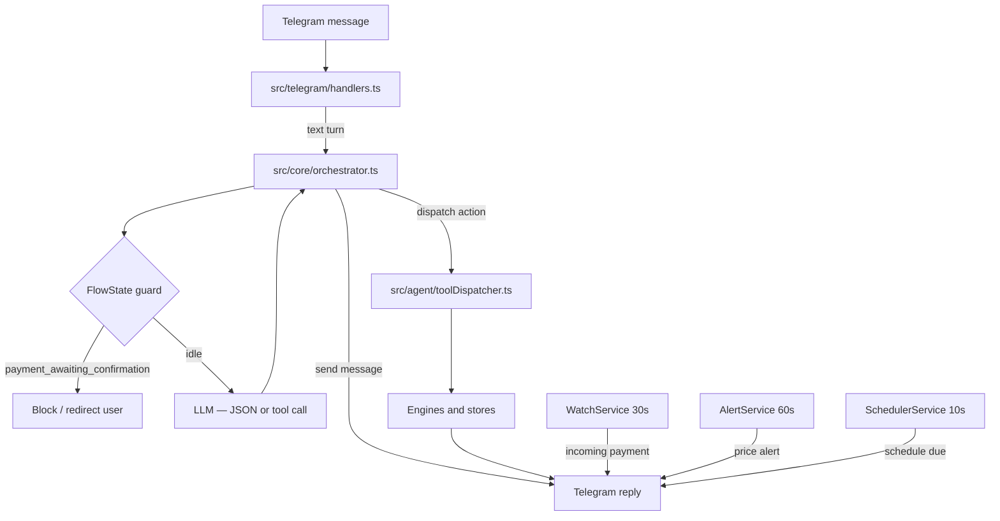

# System Overview

## Main flow

## Main layers

### Telegram layer

Handles:

- incoming text turns
- media upload (invoice PDF and photo)
- callback queries (confirm / cancel / schedule actions)
- command registration

### Orchestrator layer (`src/core/orchestrator.ts`)

Owns:

- FlowState guard — blocks or redirects while `payment_awaiting_confirmation`
- capability query interception (no LLM needed)
- LLM call — either JSON mode (`handleMessageWithJson`) or native tool calling (`handleMessageWithTools`)
- `isFabricatedMessage` — suppresses LLM-fabricated data in data-display responses
- dispatch to `ToolDispatcher`
- live research via `ResearchTools`

### Agent layer (`src/agent/`)

Owns:

- tool dispatch (`toolDispatcher.ts`) — maps validated actions to engine methods
- conversation memory (`conversationMemory.ts`) — messages, flowState, lastAction, lastPayment, lastVendor, lastSchedule, lastInvoice
- episodic memory (`episodicMemory.ts`) — compact session summaries

### Engine layer (`src/engines/`)

Owns:

- payment execution and confirmation lifecycle
- invoice extraction and session lifecycle
- payment requests
- analytics and risk
- agent identity, reputation, and validation recovery

### Storage layer (`src/storage/`)

Owns:

- wallets
- vendors
- pending payments
- payment logs
- schedules
- persistence backend (SQLite or PostgreSQL)

## Main modules

### `src/index.ts`

Composition root for:

- config loading
- persistence bootstrap
- store and engine creation
- orchestrator and tool dispatcher wiring
- health server and background service startup

### `src/telegram/`

Transport layer for:

- commands (`/start`, `/help`, `/llmkey`, `/reset`)
- invoice uploads
- callback query flows
- text ingress to orchestrator

### `src/core/orchestrator.ts`

Single-file runtime for:

- FlowState guard (payment_awaiting_confirmation, invoice_awaiting_override)
- LLM call and intent parse/validate
- fabricated message suppression (`isFabricatedMessage`)
- action dispatch
- TERMINAL_ACTIONS loop break

### `src/agent/`

Tool dispatch and memory:

- `toolDispatcher.ts` — maps actions to engines
- `conversationMemory.ts` — per-user state including FlowState
- `episodicMemory.ts` — compact session event log

### `src/ai/`

LLM client and prompts:

- `llmJsonClient.ts` — JSON and native tool calling modes
- `systemPrompt.ts` — BASE (JSON) and SLIM (tool calling) prompts
- `toolDefinitions.ts` — canonical tool schemas, TERMINAL_ACTIONS set
- `intentValidator.ts` — validates LLM output before dispatch

### `src/engines/`

Domain engines for:

- payments
- invoices
- analytics
- risk
- agent identity

### `src/services/`

Background services:

- `scheduler.ts` — due schedule reminders every 10s
- `watchService.ts` — incoming payment polling every 30s
- `alertService.ts` — crypto price alert polling every 60s
- `fxRateService.ts` — ECB FX rate helper

## Walkthroughs

### Conversational turn

1. user sends a text message
2. orchestrator checks FlowState — idle, continue
3. LLM returns `{"message": "...", "action": null}`
4. orchestrator sends message; no dispatch

### Direct payment turn

1. user asks to send money
2. orchestrator calls LLM — returns `{"action":"create_payment","amount":5,"beneficiary":"aws"}`
3. `ToolDispatcher` calls `paymentEngine.preparePayment()`
4. payment card with Confirm / Cancel buttons shown
5. orchestrator sets FlowState to `payment_awaiting_confirmation`

### Payment confirmation

1. user presses Confirm button (callback query)
2. `handlers.ts` calls `paymentEngine.processCallback()`
3. engine validates balance, Arc chain, submits through Circle
4. transaction reconciled; payment log saved; FlowState cleared

### Invoice override turn

1. active invoice session is `review_required`
2. user explicitly approves (`pay it anyway`)
3. orchestrator detects invoice FlowState, calls `invoiceEngine.prepareFromSession()`
4. payment card shown; FlowState moves to `payment_awaiting_confirmation`
