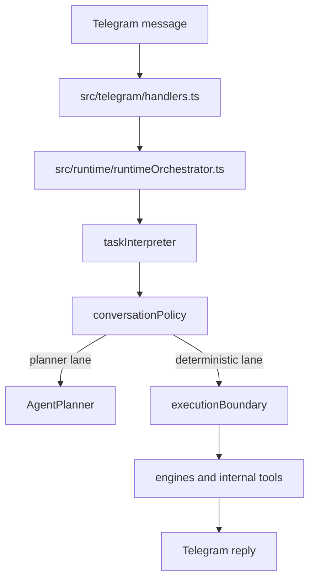

# System Overview

## Main flow

## Main layers

### Telegram layer

Handles:

- incoming text
- media upload
- callbacks
- composed invoice upload behavior

### Runtime layer

Owns:

- interpreter-first turn routing
- session-aware follow-up handling
- deterministic conversation policy

### Engine layer

Owns:

- payment execution
- invoice extraction and session lifecycle
- payment requests
- analytics and risk
- agent identity, reputation, and validation recovery

### Storage layer

Owns:

- wallets
- vendors
- pending payments
- payment logs
- schedules
- persistence backend

## Main modules

### `src/index.ts`

Composition root for:

- config loading
- persistence bootstrap
- store and engine creation
- tool registration
- health server and scheduler startup

### `src/telegram/`

Transport layer for:

- commands
- uploads
- callbacks
- runtime-first ingress

### `src/runtime/`

Conversation shell for:

- interpretation
- policy
- execution boundary
- session and task state

### `src/agent/`

Planner and tooling layer for:

- planner
- tool registry and router
- internal tools
- memory and task store

### `src/engines/`

Domain engines for:

- payments
- invoices
- analytics
- risk

## Walkthroughs

### Planner-first help turn

1. user asks for broad help
2. interpreter frames planner-style help
3. planner responds
4. no domain mutation occurs

### Deterministic payment turn

1. user asks to send money
2. interpreter resolves executable payment frame
3. execution boundary keeps it deterministic
4. payment engine opens review

### Invoice override turn

1. active invoice session is `review_required`
2. user explicitly overrides
3. invoice follow-up handler opens payment review
4. session becomes `awaiting_payment_confirmation`
